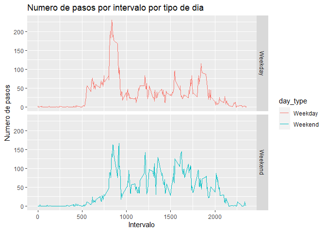

## Loading and preprocessing the data

1 Load data

2 clear values N/A


```r
library(knitr)
library(dplyr)
```

```
## 
## Attaching package: 'dplyr'
```

```
## The following objects are masked from 'package:stats':
## 
##     filter, lag
```

```
## The following objects are masked from 'package:base':
## 
##     intersect, setdiff, setequal, union
```

```r
datosgen <- read.csv("~/cientifico de datos/Reproducible Research/data/activity.csv",header = TRUE  )
names(datosgen)
```

```
## [1] "steps"    "date"     "interval"
```

```r
#clear values N/A
datos <- datosgen[complete.cases(datosgen), ]
```

## What is mean total number of steps taken per day?

```r
#Calcular el Nro total de pasos por dia
dias <- group_by(datos, date)
pasospordia <- summarise(dias, total_pasos = sum(steps))
```

```
## `summarise()` ungrouping output (override with `.groups` argument)
```

```r
summary(pasospordia)
```

```
##      date            total_pasos   
##  Length:53          Min.   :   41  
##  Class :character   1st Qu.: 8841  
##  Mode  :character   Median :10765  
##                     Mean   :10766  
##                     3rd Qu.:13294  
##                     Max.   :21194
```

```r
#media de Numero de pasos por dia
print(paste("El valor de la media es",round(mean(pasospordia$total_pasos,digits = 1))))
```

```
## [1] "El valor de la media es 10766"
```

```r
#mediana de numero de pasos por dia
print(paste("El valor de la mediana es",median(pasospordia$total_pasos)))
```

```
## [1] "El valor de la mediana es 10765"
```

## What is the average daily activity pattern?

```r
    library(ggplot2)
    #Numero promedio de pasos por intervalo diario
    intervalo_pasos <- aggregate(steps ~ interval, datos, mean)
    
    # Grafica de intervalos de tiempos 
    plot(intervalo_pasos$interval, intervalo_pasos$steps, type='l', 
         main="Numero medio de pasos por intervalos", xlab="Intervalo de Tiempo", 
         ylab="Numero medio de pasos")
```

<!-- -->

```r
    #intervalo que tiene los pasos promedio más altos
    intervalos_max <- which.max(intervalo_pasos$steps)

    #intervalo con numero maximo de pasos
    intervalo_pasos[intervalos_max, ]
```

```
##     interval    steps
## 104      835 206.1698
```

    #intervalo que tiene los pasos promedio más altos
    print (paste("El intervalo con los pasos promedio más altos es ",   intervalo_pasos[intervalos_max, ]$interval," y el número de pasos para ese intervalo es ",
             round(intervalo_pasos[intervalos_max, ]$steps, digits = 1)))


## Imputing missing values

```r
#numero de filas totales con N/A
print (paste("Numero de valores NA es: ",sum(is.na(datosgen))))
```

```
## [1] "Numero de valores NA es:  2304"
```

```r
#se creara un nuevo marco de datos "datos_asignados"
#Se buscara los valores NA para el campo "steep"
#Se reemplazaran las N/A con una media intervalo de 5 minutos
datos_asignados <- datosgen
for (i in 1:nrow(datos_asignados)) {
    if (is.na(datos_asignados$steps[i])) {
      valor_pasos <- intervalo_pasos$steps[which(intervalo_pasos$interval ==
datos_asignados$interval[i])]
      datos_asignados$steps[i] <- valor_pasos
  }
}

# Agregar los pasos por dia con loss valores calculados
Numero_total_de_pasos_por_dia <- aggregate(steps ~ date, datos_asignados, sum)
#head(datos_asignados)
# Histograma con los valores calculados
hist(Numero_total_de_pasos_por_dia$steps, main = "Histograma de numero total de pasos por dia Imputados", xlab = "Pasos por dia")
```

<!-- -->

```r
#Calcule e informe la  media  y la  mediana del  número total de pasos dados por día

#media de Numero de pasos por dia
print(paste("El valor de la media con datos a N/A imputados es",round(mean(Numero_total_de_pasos_por_dia$steps,digits = 1))))
```

```
## [1] "El valor de la media con datos a N/A imputados es 10766"
```

```r
print(paste("El valor de la media es",round(mean(pasospordia$total_pasos,digits = 1))))
```

```
## [1] "El valor de la media es 10766"
```

```r
#mediana de numero de pasos por dia
print(paste("El valor de la mediana con datos a N/A imputados es",median(Numero_total_de_pasos_por_dia$steps)))
```

```
## [1] "El valor de la mediana con datos a N/A imputados es 10766.1886792453"
```

```r
print(paste("El valor de la mediana es",median(pasospordia$total_pasos)))
```

```
## [1] "El valor de la mediana es 10765"
```

```r
#La media es la misma, La mediana cambia un poco pasa de 10765 pasos a 10766,18 pasos al asignar valores a N/A
```


## Are there differences in activity patterns between weekdays and weekends?


```r
    #Función para determinar si la fecha es un día de la semana
    semana_dia <- function(valor_fecha) {
      semdia <- weekdays(as.Date(valor_fecha, '%Y-%m-%d'))
      if  (!(semdia == 'Saturday' || semdia == 'Sunday')) {
        a <- 'Weekday'
      } else {
        a <- 'Weekend'
      }
      a
    }
    #Aplicar la función al conjunto de datos para crear una nueva variable de tipo de día
    datos_asignados$day_type <- as.factor(sapply(datos_asignados$date, semana_dia))
    names(datos_asignados)
```

```
## [1] "steps"    "date"     "interval" "day_type"
```

```r
     # marco de datos agregado por intervalos
    Numero_total_de_pasos_por_dia <- aggregate(steps ~ interval+day_type, datos_asignados,     mean)

   # Graficar la trama
   ggplot(Numero_total_de_pasos_por_dia, aes(interval, steps)) +
   geom_line(stat = "identity", aes(colour = day_type)) + 
   theme_gray() +
   facet_grid(day_type ~ ., scales = "fixed", space = "fixed") + 
   labs(x="Intervalo",  y = expression("Numero de pasos")) +
   ggtitle("Numero de pasos por intervalo por tipo de dia")
```

<!-- -->
